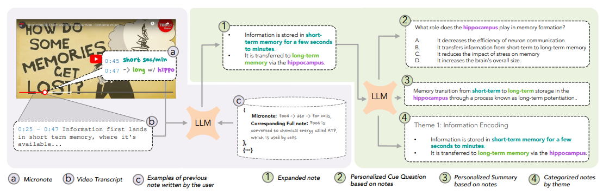

# NoTeeline: Supporting Real-Time, Personalized Notetaking with LLM-Enhanced Micronotes

<p align = "center">
    
    <br>
    <b>Write, Organize, Review, and Summarize Personalized Notes</b>
</p>

<p align = "center">
    <a target = "_blank" href = "https://noteeline.vercel.app/">Website</a> •
    <a target = "_blank" href = "https://doi.org/10.1145/3708359.3712086">Paper</a> •
    <a target = "_blank" href = "https://arxiv.org/abs/2409.16493">Arxiv</a>
</p>

## Teaser
<div style="display: flex; justify-content: center; align-items: center; height: 100vh;">
  <video width="600" height="600" controls style="max-width: 100%; height: auto;">
    <source src="Assets/noteeline_compressed.mp4" type="video/mp4">
    Your browser does not support the video tag.
  </video>
</div>

You can also watch the teaser in [YouTube](https://www.youtube.com/watch?v=UUWTUbET86I) <br />

<div align="center">
  <a href="https://youtu.be/UUWTUbET86I" title="NoTeeline">
    
  </a>
</div>

## News
- `[31-01-2025]` Updated readme, motivated by [webarena](https://github.com/web-arena-x/webarena)
- `[28-01-2025]` The micronotes can be expanded using the openai api which produces streamlined real-time output
- `[28-01-2025]` A personal openai api key is to be provided in the landing page of NoTeeline for the app to work
- `[28-01-2025]` NoTeeline got featured in huggingface, [link](https://huggingface.co/papers/2409.16493)

## Local Development
 - Clone the repo using the following command:
	`$ git clone https://github.com/oaishi/NoTeeline.git`
- If *npm* is the desired package manager, then just replace the command:
	- `yarn` with the command `npm install`
	- `yarn dev` with the command `npm run dev`

### Frontend
- `cd` into the folder **Frontend** Run `yarn` to install all the necessary packages
- While the current working directory is **Frontend**, run the command `yarn dev` to start the frontend

### Backend
- In order to start the server, `cd` into the **Backend** folder and run `yarn` to install all the necessary packages for the backend server
- While being in the **Backend** directory, run the command `node index.js` to start the server at port 3000
- The file `transcript.py` is originally used in a flask-based server to send transcript of youtube videos. When developing in a physical machine (**not cloud**), it could be transformed into a js code to be used by the server file `index.js`

## Citation
If you use the NoTeeline code or data, please cite our paper:
```
@inproceedings{faria2025noteeline,
  author = {Faria Huq, Abdus Samee, David Chuan-En Lin, Alice Xiaodi Tang, and Jeffrey P Bigham},
  title = {NoTeeline: Supporting Real-Time, Personalized Notetaking with LLM-Enhanced Micronotes},
  year = {2025},
  publisher = {Association for Computing Machinery},
  address = {New York, NY, USA},
  booktitle = {Proceedings of the 30th International Conference on Intelligent User Interfaces},
  numpages = {18},
  location = {Cagliari, Italy}
}
```
